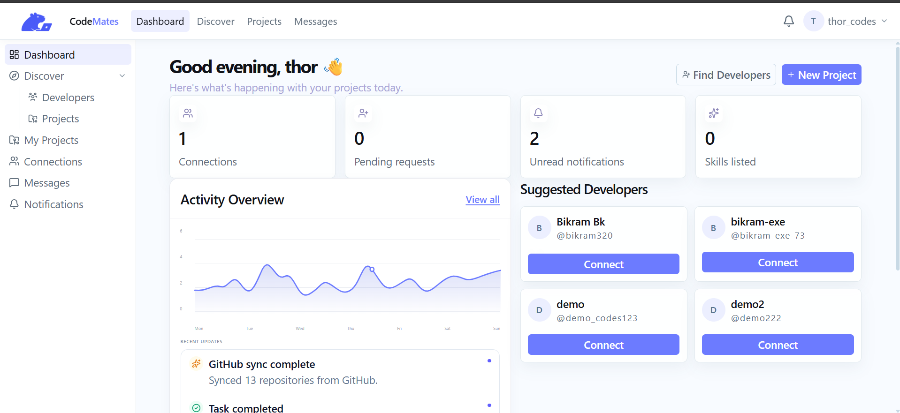
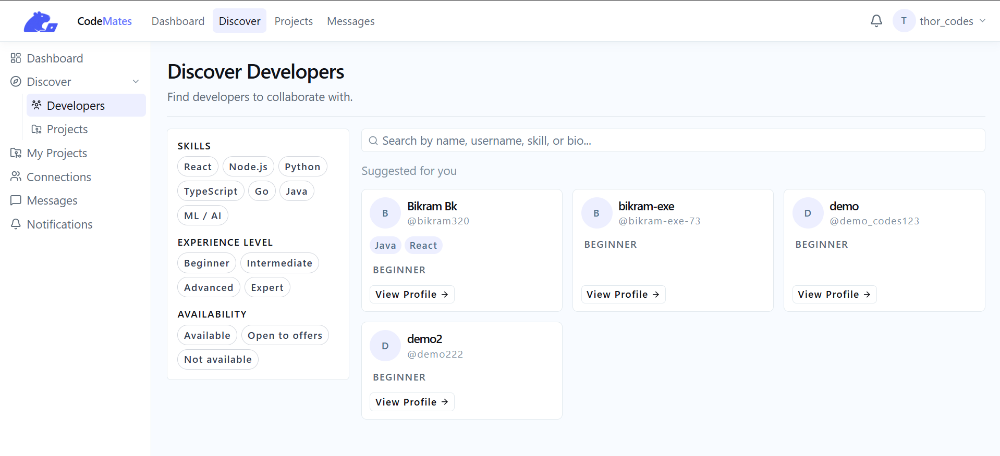
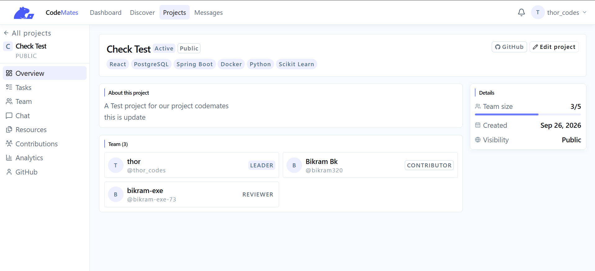
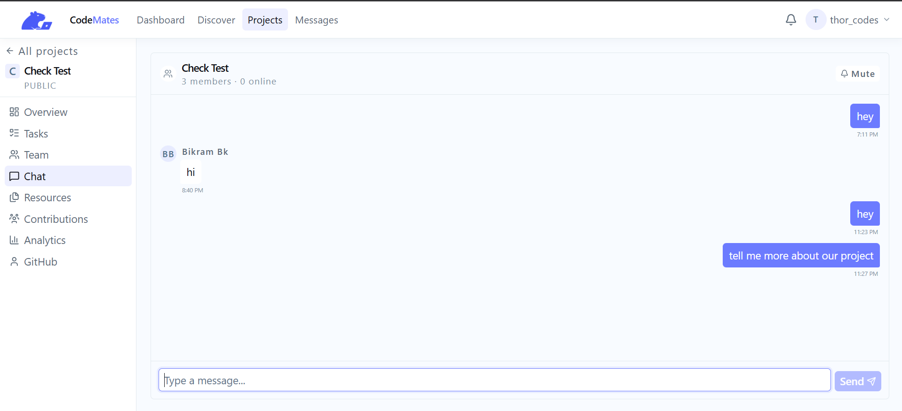
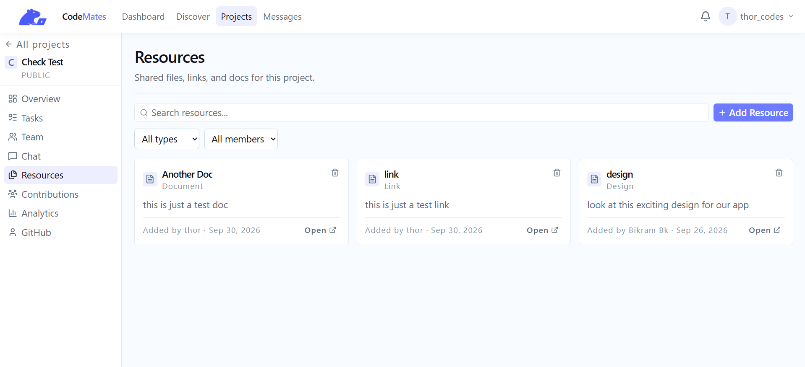
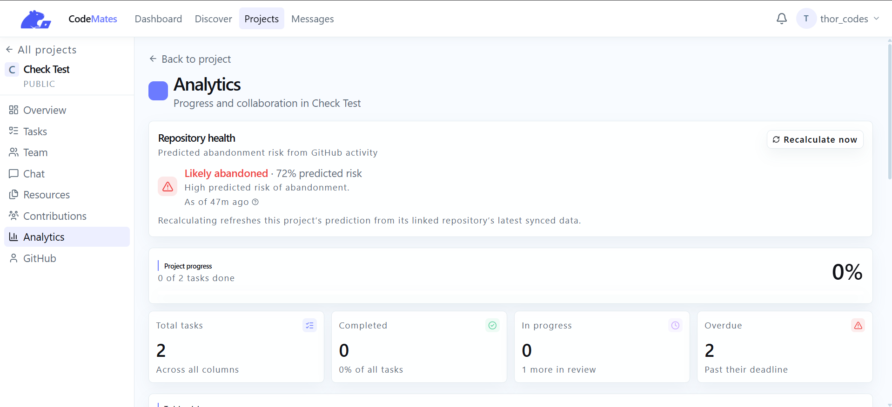
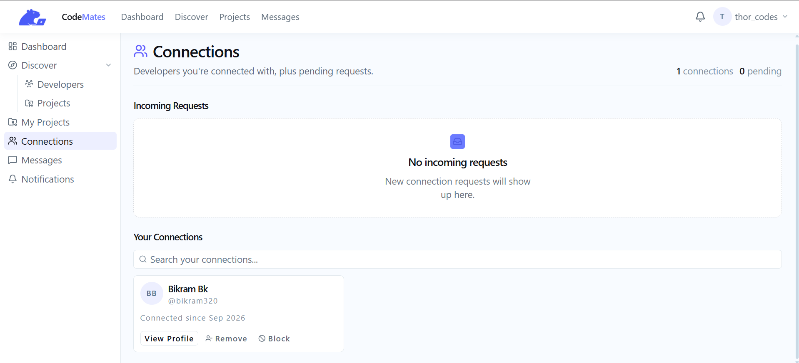

# CodeMates — Intelligent Developer Collaboration Platform

CodeMates is a full-stack platform built to help developers **discover teammates, create and manage projects, communicate in real time, and track team contributions** from a single workspace.

The platform combines developer networking, project management, real-time communication, GitHub integration, and machine-learning-powered collaboration features into one ecosystem.

> **Discover developers → Build teams → Collaborate → Track contributions**

---

## 🚀 Features

### 👨‍💻 Developer Profiles

Create a developer profile showcasing:

* Skills and technologies
* Experience level
* Bio and portfolio
* GitHub profile
* Developer activity

---

### 🔎 Developer Discovery

Find developers based on their technical background and interests.

* Skill-based developer search
* Experience filtering
* Interest-based discovery
* GitHub activity insights

---

### 🤝 Developer Networking

Connect and communicate with other developers through a dedicated social layer.

* Send and manage connection requests
* Accept, reject, block, or remove connections
* View developer profiles
* Direct messaging
* Developer connections

---

### 🚀 Project Collaboration

Create projects and build development teams in a shared workspace.

* Create and manage projects
* Connect projects with GitHub repositories
* Invite developers to projects
* Assign team roles
* Manage project members
* Project discussion space
* Share external project resources

Supported project roles include:

**Leader · Contributor · Reviewer**

---

### 📋 Kanban Task Management

Each project includes a Kanban-style task management system.

**To Do → In Progress → Review → Done**

Tasks support:

* Assignment to team members
* Priorities
* Deadlines
* Comments
* Status updates

---

### 💬 Real-Time Communication

CodeMates uses WebSockets for real-time collaboration.

* Project discussion chat
* Real-time messaging
* Direct messaging
* Live collaboration events

---

### 📊 Contribution Tracking

CodeMates tracks developer activity across projects to provide a clearer picture of team participation.

Contribution signals include:

* Task completion
* GitHub commits
* Messaging and participation
* Project activity

These signals are used to generate contribution data that helps teams understand individual participation and project engagement.

---

### 🐙 GitHub Integration

Connect GitHub directly with your CodeMates developer and project workflow.

* GitHub OAuth authentication
* GitHub profile integration
* Repository retrieval
* Repository linking
* Commit synchronization
* Contribution activity tracking

This allows project activity to be connected with real development activity on GitHub.

---

## 🧠 Machine Learning

CodeMates includes an ML layer designed to make developer collaboration more intelligent.

### Developer Matching

The matching system is designed to evaluate developers using multiple signals such as:

* Technical skills
* Interests
* GitHub activity
* Project relevance

The model produces a **match score** that can be used to rank developers based on their compatibility with a project or team.

### Contribution Intelligence

Developer activity such as task completion, GitHub commits, and collaboration activity provides data for analyzing contribution patterns and team participation.

### Project Health Analytics

The collected project and contribution data also provides the foundation for intelligent project analytics, including identifying productivity trends and potential project risks.

---

## 🛠️ Tech Stack

### Frontend

* **React.js**
* **Tailwind CSS**
* **React Query**

### Backend

* **Java**
* **Spring Boot**
* **Spring Security**
* **JWT Authentication**
* **Microservices Architecture**

### Database & Caching

* **PostgreSQL**
* **Redis**

### Communication & Events

* **Apache Kafka**
* **WebSockets**

### External Integration

* **GitHub API**
* **GitHub OAuth**

---

## 🏗️ Architecture

CodeMates follows a microservices-based architecture where different services handle specific responsibilities such as authentication, users, projects, social interactions, messaging, notifications, GitHub integration, and contribution tracking.

Kafka is used for asynchronous communication between services, while WebSockets provide real-time communication for collaborative features.

```text
                        ┌─────────────────┐
                        │    React App    │
                        └────────┬────────┘
                                 │
                                 ▼
                        ┌─────────────────┐
                        │   API Gateway   │
                        └────────┬────────┘
                                 │
              ┌──────────────────┼──────────────────┐
              │                  │                  │
              ▼                  ▼                  ▼
        ┌───────────┐      ┌───────────┐      ┌───────────┐
        │   Auth    │      │  Project  │      │  Social   │
        │  Service  │      │  Service  │      │  Service  │
        └───────────┘      └───────────┘      └───────────┘
              │                  │                  │
              └──────────────────┼──────────────────┘
                                 ▼
                        ┌─────────────────┐
                        │      Kafka      │
                        └────────┬────────┘
                                 │
                 ┌───────────────┼───────────────┐
                 ▼               ▼               ▼
           PostgreSQL          Redis          GitHub API
```

---

## 📸 Screenshots



---



---



---



---



---



---



---

## 🎯 Vision

CodeMates aims to bring the different parts of developer collaboration into one platform — from **finding the right teammates to building projects and understanding team contributions**.

The long-term vision is to make collaboration more intelligent through machine learning while keeping the core platform focused on practical developer workflows.

---

## 👨‍💻 Built With

CodeMates was developed as a collaborative software engineering project with a focus on:

**Microservices · Event-Driven Architecture · Real-Time Systems · Secure Authentication · GitHub Integration · Collaborative Development · Machine Learning**
